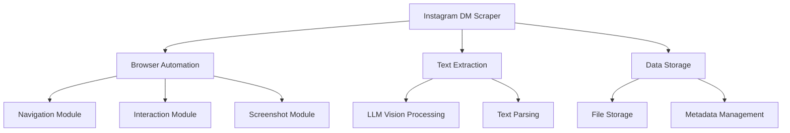
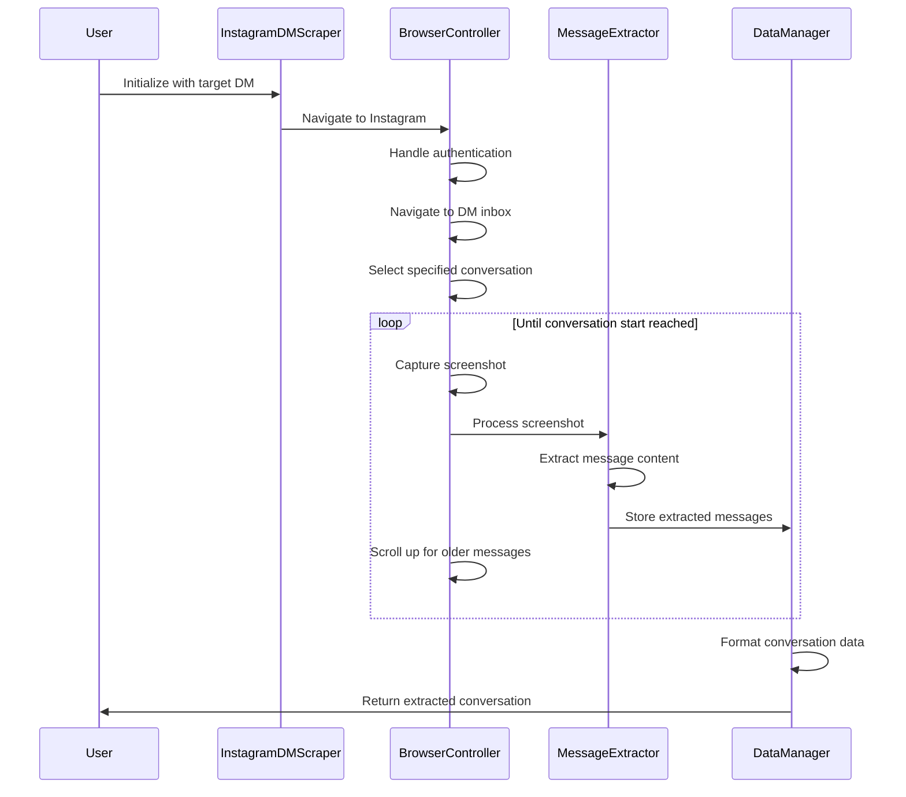

# Instagram DM Scraper: Architectural Plan

## 1. Project Overview

This plan outlines the enhancements required to the browser-use repository to create a solution for scraping Instagram direct messages. The solution will navigate to Instagram's DM inbox, select a specific conversation, capture screenshots of the messages, extract text using LLM vision capabilities, scroll to access older messages, and save all extracted content to a text file.

## 2. System Architecture



## 3. Component Breakdown

### 3.1 Core Components

1. **InstagramDMScraper Class**
   - Main controller that orchestrates the entire process
   - Manages the workflow from login to data extraction and storage
   - Handles error recovery and session management

2. **BrowserController**
   - Extends the existing CustomBrowser functionality
   - Provides specialized methods for Instagram navigation
   - Manages browser state during the scraping process

3. **MessageExtractor**
   - Processes screenshots using LLM vision capabilities
   - Parses extracted text to identify message content, senders, and timestamps
   - Maintains conversation context for accurate extraction

4. **DataManager**
   - Handles storage of extracted messages
   - Manages metadata about the scraping process
   - Provides export functionality in various formats

### 3.2 Supporting Components

1. **InstagramAuthHandler**
   - Manages Instagram authentication
   - Handles login challenges and session persistence

2. **ScrollManager**
   - Controls scrolling behavior to access older messages
   - Detects when the beginning of the conversation has been reached
   - Manages scroll position to avoid duplicate content

3. **ProgressTracker**
   - Monitors and reports on the scraping progress
   - Provides checkpointing for resumable operations
   - Logs statistics about the extraction process

## 4. Implementation Plan

### 4.1 New Files to Create

1. **`instagram_dm_scraper.py`**
   ```python
   # Main script that implements the InstagramDMScraper class
   # Orchestrates the entire scraping process
   ```

2. **`instagram_browser_controller.py`**
   ```python
   # Extends CustomBrowser with Instagram-specific functionality
   # Handles navigation, interaction, and state management
   ```

3. **`message_extractor.py`**
   ```python
   # Implements the MessageExtractor class
   # Processes screenshots and extracts structured message data
   ```

4. **`data_manager.py`**
   ```python
   # Implements the DataManager class
   # Handles storage, formatting, and export of extracted data
   ```

5. **`instagram_auth_handler.py`**
   ```python
   # Implements the InstagramAuthHandler class
   # Manages authentication and session persistence
   ```

6. **`scroll_manager.py`**
   ```python
   # Implements the ScrollManager class
   # Controls scrolling behavior and position tracking
   ```

7. **`progress_tracker.py`**
   ```python
   # Implements the ProgressTracker class
   # Monitors and reports on scraping progress
   ```

8. **`config.py`**
   ```python
   # Configuration settings for the Instagram DM scraper
   # Includes parameters for behavior customization
   ```

### 4.2 Modifications to Existing Files

1. **`src/controller/custom_controller.py`**
   - Add Instagram-specific actions for DM navigation and interaction
   - Implement specialized scrolling actions for message history

2. **`src/agent/custom_prompts.py`**
   - Create Instagram-specific prompt templates for the LLM
   - Optimize prompts for message extraction from screenshots

3. **`src/utils/utils.py`**
   - Add utility functions for Instagram-specific operations
   - Implement helper methods for text processing and formatting

## 5. Workflow Process



## 6. Key Technical Challenges

1. **Instagram Authentication**
   - Handling login challenges and two-factor authentication
   - Maintaining session persistence across browser instances

2. **Dynamic Content Detection**
   - Identifying when new messages have loaded after scrolling
   - Detecting when the beginning of the conversation has been reached

3. **Message Attribution**
   - Correctly identifying message senders and recipients
   - Maintaining conversation context during extraction

4. **Rate Limiting and Detection Avoidance**
   - Implementing appropriate delays between actions
   - Mimicking human-like browsing behavior to avoid detection

5. **Error Recovery**
   - Handling network issues and page loading failures
   - Implementing retry mechanisms for failed operations

## 7. LLM Vision Integration

### 7.1 Screenshot Processing

The LLM vision component will process screenshots with the following approach:

1. **Segmentation**: Divide the screenshot into message blocks
2. **Entity Recognition**: Identify senders, timestamps, and message content
3. **Context Preservation**: Maintain conversation flow and context
4. **Structured Output**: Format extracted data in a consistent structure

### 7.2 Prompt Engineering

Specialized prompts will be created to optimize the LLM's ability to extract message content:

```
You are an expert at extracting Instagram direct messages from screenshots.
Given the following screenshot of an Instagram DM conversation:

1. Identify each message block
2. For each message, extract:
   - Sender name
   - Message content
   - Timestamp (if visible)
3. Maintain the conversation order
4. Format the output as structured text

Output format:
[Sender]: Message content (Timestamp)
```

## 8. Data Storage Format

The extracted messages will be stored in a structured text format:

```
# Instagram DM Conversation: [Conversation Partner]
# Extraction Date: [Date and Time]
# Total Messages: [Count]

[Timestamp] [Sender]: Message content
[Timestamp] [Recipient]: Response content
...
```

Additional metadata will be stored separately to track the extraction process:

```json
{
  "conversation_id": "username_of_partner",
  "extraction_start": "ISO-datetime",
  "extraction_end": "ISO-datetime",
  "total_messages": 123,
  "scroll_operations": 45,
  "screenshots_processed": 50
}
```

## 9. Implementation Phases

### Phase 1: Core Infrastructure
- Implement basic browser navigation and authentication
- Create screenshot capture functionality
- Develop initial LLM vision integration

### Phase 2: Message Extraction
- Implement message parsing and structure recognition
- Develop scrolling mechanism for historical messages
- Create data storage and formatting

### Phase 3: Robustness and Optimization
- Add error handling and recovery mechanisms
- Implement rate limiting and detection avoidance
- Optimize LLM prompts for accuracy and efficiency

### Phase 4: User Interface and Configuration
- Create configuration options for customization
- Implement progress reporting and statistics
- Develop user-friendly command-line interface

## 10. Testing Strategy

1. **Unit Testing**
   - Test individual components in isolation
   - Mock browser and LLM interactions for controlled testing

2. **Integration Testing**
   - Test the interaction between components
   - Verify data flow through the system

3. **End-to-End Testing**
   - Test the complete workflow with a test Instagram account
   - Verify extraction accuracy and completeness

4. **Performance Testing**
   - Measure extraction speed and resource usage
   - Optimize for efficiency and reliability

## 11. Ethical and Legal Considerations

1. **Terms of Service Compliance**
   - Review Instagram's terms of service regarding automated access
   - Implement appropriate rate limiting and delays

2. **Privacy Protection**
   - Ensure extracted data is handled securely
   - Implement options to anonymize sensitive information

3. **Data Retention**
   - Provide options for secure data storage and deletion
   - Implement data minimization principles

## 12. Future Enhancements

1. **Multi-conversation Support**
   - Extend functionality to process multiple conversations
   - Implement batch processing capabilities

2. **Media Content Extraction**
   - Add support for extracting shared images and videos
   - Implement media file downloading and organization

3. **Analytics Integration**
   - Develop conversation analysis capabilities
   - Implement visualization of conversation patterns

4. **Incremental Updates**
   - Add support for updating existing extractions with new messages
   - Implement change detection and differential extraction
